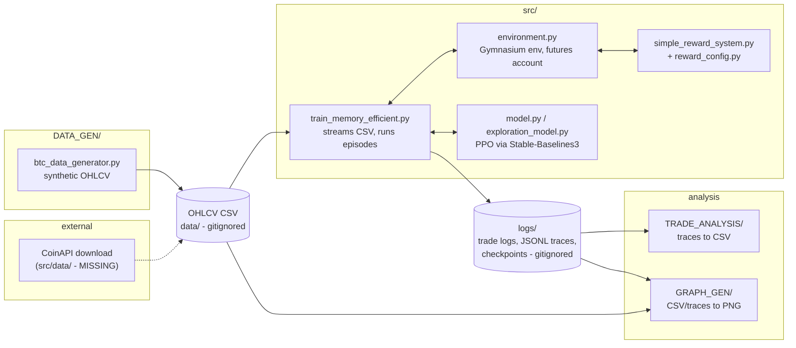

# trading-bot-v5-rl

A reinforcement-learning sandbox for BTC perpetual-futures trading: a Gymnasium
environment that simulates a leveraged futures account, a PPO agent built on
Stable-Baselines3, a synthetic OHLCV data generator to train it on, and a set of
tools that turn the resulting trade traces into CSVs and charts.

## Status: superseded research sandbox, not runnable as checked out

This is the fifth iteration of a personal trading-bot experiment and it is no
longer being developed. It is published for reference, not for use. Two things
are worth knowing before you read further:

- **The training entry point does not run from a fresh clone.**
  `src/train_memory_efficient.py` imports `data.setup_data.DataProcessor` and
  `src/training/data_manager.py` imports `..data.download_coinapi` and
  `..data.setup_data`. There is no `src/data/` package in this repository, so
  those imports fail immediately. The same script also expects
  `config/training_config.json` and `config/logging_config.json`, which are not
  here either - the repository's `.gitignore` has a blanket `*.json` rule that
  excluded them. Neither the missing package nor the missing config files have
  been reconstructed.
- **Several tracked files are empty.** `src/btc_data_generator.py`,
  `src/example_generator.py`, `GRAPH_GEN/btc_graph_generator.py`,
  `generate_datasets.bat`, `generate_datasets.ps1` and
  `scripts/test_individual_trade_closing.py` are all zero bytes. They were
  committed as placeholders and never filled in. Working equivalents of the
  first three live in `DATA_GEN/` and in the `_fixed` / `_simple` variants in
  `GRAPH_GEN/` - see [Usage](#usage).

What *does* work as checked out is the synthetic data generation
(`DATA_GEN/`), the environment and reward code in `src/` (exercised by the
scripts in `scripts/`), and the analysis and charting tools - provided you
supply the CSV or JSONL files they read.

There is no trained model, no dataset and no training log in this repository.
Everything of that kind is gitignored.

## How it works

The pipeline runs left to right. Each stage writes files that the next stage
reads; there is no in-process coupling between them, so any stage can be run on
its own if you already have its inputs.



**The environment** (`src/environment.py`, the largest file here at ~1,700
lines) is a `gymnasium.Env` that models a leveraged futures account rather than
a single position. It tracks a list of individual open trades, each with its own
entry price, size and unrealised P&L, and hands the agent up to
`MAX_OBSERVED_TRADES = 10` of them in the observation. The observation vector is

```
len(feature_columns) * lookback_window   # normalised OHLCV window, plus any
                                         # extra numeric columns in the CSV
+ 7                                      # account state
+ 10 * 4                                 # up to 10 open trade slots
```

Prices in the window are normalised against the first close in the window and
volumes are log-transformed and standardised.

**The action space** has two forms, selected by the `use_discretized_actions`
flag. Both are `Box(3,)` of `[action_type, size, leverage]` where `action_type`
is `0 = HOLD, 1 = BUY, 2 = SELL, 3 = CLOSE_ALL`. In continuous mode `size` is a
fraction in `[0.0, 0.5]`; in discretised mode it is an index into a fixed list
of small position sizes. `src/utils/action_wrapper.py` provides
`TrulyDiscreteActionWrapper`, which collapses the whole thing to a plain
`Discrete(4)` and fixes size and leverage - it exists because the agent was not
exploring SELL and CLOSE_ALL when the action head was continuous.

**The reward** comes from `src/simple_reward_system.py`, tuned by
`src/reward_config.py`. It is deliberately shaped rather than pure P&L: an
exploration bonus for using actions that have not appeared in the last 20 steps,
escalating penalties once more than 5 (and then 10) trades are open at once,
tiered rewards and penalties at 1/3/5/10% profit and loss, and a bonus for
closing when the book is crowded. `reward_config.py` also ships
`CONSERVATIVE_CONFIG` and `AGGRESSIVE_CONFIG` variants. Details are in
[docs/reward-system.md](docs/reward-system.md).

**The agent** is Stable-Baselines3 PPO with a custom features extractor.
`src/model.py` is the plain version; `src/exploration_model.py` adds a higher
entropy coefficient and exploration callbacks; `src/fixed_exploration_model.py`
is a further variant that rescales the action distribution. Only
`exploration_model.py` is wired into the training script.

**Logging** is heavy by design, because diagnosing what the agent was doing was
most of the work. `src/utils/trade_logger.py` writes per-step and per-trade
records, and `src/utils/trade_tracer.py` writes a JSONL trace per trade that
carries the market snapshot, the reward breakdown and net worth at entry and
exit. Those JSONL traces are what `TRADE_ANALYSIS/` and `GRAPH_GEN/` consume.
`src/utils/archiver.py` zips the previous run's `logs/` and models into
`archives/` before each new training run.

## Requirements

- Python 3.9 or newer. Nothing in the code pins a version; 3.9+ covers the
  type-hint syntax used and the Gymnasium/SB3 versions listed below.
- The packages in `requirements.txt`.

`requirements.txt` at the root was empty in this repository's history and has
been assembled from the actual imports in the source. The version numbers there
are floors, not a verified lockfile - the only hard constraint that comes from
the code is `stable-baselines3 >= 2.0`, because the environment returns the
five-value Gymnasium `step()` tuple. `DATA_GEN/requirements.txt` and
`GRAPH_GEN/requirements.txt` list the smaller subsets those two tools need on
their own.

## Setup

```bash
git clone https://github.com/chinthakat/trading-bot-v5-rl.git
cd trading-bot-v5-rl

python -m venv .venv
# Windows
.venv\Scripts\activate
# macOS / Linux
source .venv/bin/activate

pip install -r requirements.txt
```

If you intend to touch the data-download path, copy the environment template:

```bash
cp .env.example .env      # then edit .env
```

## Configuration

### Environment variables

Read via `python-dotenv` from a `.env` file in the working directory.

| Variable | Read by | Purpose |
| --- | --- | --- |
| `COINAPI_API_KEY` | `src/training/data_manager.py` | CoinAPI key for downloading historical OHLCV data. `DataManager.download_data()` raises if it is unset. This is the only environment variable anything in the repository reads. Note that `data_manager.py` cannot currently be imported - see [Status](#status-superseded-research-sandbox-not-runnable-as-checked-out). |

Never commit `.env`; it is gitignored. `.env.example` holds placeholders only.

### Config files

`src/train_memory_efficient.py` loads `config/training_config.json` (via
`--config`) and `config/logging_config.json` (via `--logging-config`).
**Neither file is in this repository.** The table below lists the keys the code
actually reads, gathered by grepping `config.get(...)` across `src/`, so that
the file could be reconstructed if anyone wanted to.

| Key | Read by | Notes |
| --- | --- | --- |
| `symbol` | `training/data_manager.py` | Default `BINANCEFTS_PERP_BTC_USDT` |
| `interval` | `training/data_manager.py`, training script | Default `15m` |
| `start_date`, `end_date`, `use_date_range`, `data_days` | data download | Range to fetch |
| `max_chunk_days`, `max_total_rows` | `training/data_manager.py` | Download batching and memory cap |
| `data_path`, `consolidated_file` | training script | Where the OHLCV CSV lives |
| `train_ratio` | training script | Train/eval split |
| `lookback_window` | environment, training script | Observation window length |
| `streaming_batch_size` | training script | Rows per CSV chunk |
| `initial_balance`, `balance`, `leverage` | environment | Simulated account |
| `total_episodes`, `steps_per_episode`, `total_timesteps` | training script | Run length |
| `device` | model | `cpu` / `cuda` |
| `model_config` | model | Nested dict passed to PPO |
| `checkpoint_dir`, `final_model_path` | model, training script | Where models are written |
| `env_config` | training script | Nested dict passed to `TradingEnvironment` |
| `reward_config`, `reward_strategy`, `reward_overrides` | environment | Selects and overrides a profile from `reward_config.py` |
| `encourage_small_trades`, `ultra_aggressive_small_trades` | environment | Position-size shaping presets |
| `close_bonus_base`, `close_bonus_scale` | reward system | Closure bonus scaling |
| `training` | training script | Synthetic-data training mode flag |
| `logging_config` | `utils/config_loader.py` | Nested dict, keys below |

Keys inside `logging_config`, with the defaults `utils/config_loader.py`
applies when they are absent:

| Key | Default |
| --- | --- |
| `enable_trade_logging` | `true` |
| `enable_trade_tracing` | `true` |
| `trade_log_frequency` | `10` |
| `console_log_level` | `INFO` |
| `file_log_level` | `DEBUG` |
| `enable_tensorboard` | `true` |
| `enable_detailed_rewards` | `false` |
| `tensorboard_log_frequency` | `100` |

## Usage

### Generate synthetic OHLCV data

`DATA_GEN/btc_data_generator.py` is the working generator (the copy at
`src/btc_data_generator.py` is empty).

```bash
python DATA_GEN/btc_data_generator.py \
  --start-date 2024-01-01 --end-date 2024-02-01 \
  --interval 15m --market-type UPTREND \
  --output data/uptrend_15m.csv
```

`--interval` accepts `1m`, `5m`, `15m`. `--market-type` accepts `UPTREND`,
`DOWNTREND`, `SWING`, `MIXED` and `CUSTOM_1`. `--initial-price` defaults to
`50000.0`; `--output` is optional. `CUSTOM_1` is a scripted twelve-month,
eight-phase dataset intended as a training curriculum - see
[docs/custom-1-dataset.md](docs/custom-1-dataset.md).

Inspect what came out:

```bash
python DATA_GEN/data_analyzer.py data/uptrend_15m.csv
python DATA_GEN/data_analyzer.py data/*.csv --summary
```

Windows batch wrappers that generate a spread of datasets in one go live at
`DATA_GEN/generate_datasets.bat` and `DATA_GEN/generate_datasets.ps1`. (The
copies of the same names in the repository root are empty files.)

### Train

```bash
python src/train_memory_efficient.py --interactive
```

Other modes are `--default` (real market data plus archiving), `--training`
(synthetic balanced data), `--auto` (defaults, no prompts), `--no-archive`, and
`--help-usage`. With no mode flag the script falls back to `--interactive`.
Interactive mode is documented in
[docs/interactive-training.md](docs/interactive-training.md).

**This will fail on a fresh clone** for the reasons given under
[Status](#status-superseded-research-sandbox-not-runnable-as-checked-out): the
`src/data/` package and the `config/*.json` files are absent. The commands are
recorded here because they are what the code expects, not because they work
today.

### Analyse trade traces

Turns the JSONL traces written during training into CSVs:

```bash
cd TRADE_ANALYSIS
python trade_trace_analyzer.py --detailed --output-dir .
python create_summary.py
```

`trade_trace_analyzer.py` also takes `--trace-file` and `--output`. The columns
of each output file are described in
[docs/trade-analysis-outputs.md](docs/trade-analysis-outputs.md).

### Charts

None of the generated PNGs are tracked - regenerate them from your own data.

```bash
cd GRAPH_GEN

# price/volume chart from an OHLCV CSV
python btc_graph_simple.py --file ../data/uptrend_15m.csv
python btc_graph_generator_fixed.py --file ../data/uptrend_15m.csv --type advanced --save chart.png

# entry/exit markers and P&L over a price series
python trade_analysis_visualizer_clean.py --save trade_analysis.png
python csv_trade_visualizer.py --trade-csv ../TRADE_ANALYSIS/trade_analysis_detailed.csv \
                               --market-csv ../data/uptrend_15m.csv

# live chart that follows a training run
python live_trade_visualizer_enhanced.py --file <trade log csv> --interval 5
```

`btc_graph_generator_fixed.py --type` accepts `single`, `advanced` and
`comparison`, and `--interactive` gives a menu-driven file picker.

Note that `GRAPH_GEN/` contains four near-duplicate trade visualizers
(`trade_analysis_visualizer.py` and its `_clean`, `_fixed` and `_pure`
variants). Use `_clean`; the unsuffixed `trade_analysis_visualizer.py` is
corrupted and does not parse - see [Known problems](#known-problems).

## Project layout

```
.
├── src/                      RL environment, PPO models, reward system, training
│   ├── environment.py        Gymnasium futures-trading env (the core of the project)
│   ├── train_memory_efficient.py  Training entry point; streams CSVs chunk by chunk
│   ├── model.py              PPO wrapper over Stable-Baselines3
│   ├── exploration_model.py  PPO variant tuned for action exploration
│   ├── simple_reward_system.py / reward_config.py  Shaped reward and its profiles
│   ├── financial_calculations.py  P&L, net worth, liquidation price, sizing
│   ├── training/data_manager.py   CoinAPI download and validation (imports are broken)
│   └── utils/                Trade logger, JSONL tracer, liquidation tracker,
│                             action wrapper, config loader, run archiver
├── DATA_GEN/                 Synthetic BTC OHLCV generator and dataset analyzer
├── GRAPH_GEN/                Chart generators for OHLCV data and trade traces
├── TRADE_ANALYSIS/           Converts JSONL trade traces into analysis CSVs
├── scripts/                  Manual probe scripts, formerly loose in the root
├── docs/                     Reference documentation
│   └── history/              Dated status notes kept as a development log
├── requirements.txt          Full dependency set
└── .env.example              The one environment variable the code reads
```

Directories the code writes to at runtime - `data/`, `logs/`, `models/`,
`archives/`, `GRAPH_GEN/graphs/` - are gitignored and absent here.

## Tests

There are none. Nothing in the repository imports `pytest`, and none of the
`test_*.py` files contain an `assert`; they are print-and-eyeball scripts. They
now live in [`scripts/`](scripts/README.md) with a description of what each one
prints. Running `pytest` against this repository will collect nothing useful.

## Known problems

Recorded rather than fixed, since the project is not being developed further.

- `src/data/` is missing, which breaks `src/train_memory_efficient.py` and
  `src/training/data_manager.py` at import time.
- `config/training_config.json` and `config/logging_config.json` are missing.
- `GRAPH_GEN/trade_analysis_visualizer.py` is corrupted: from line 245 the rest
  of the file is a single line of literal `\n` escape sequences, so it raises
  `SyntaxError` on import. The `_clean`, `_fixed` and `_pure` variants parse
  fine.
- Six tracked files are zero bytes (listed under [Status](#status-superseded-research-sandbox-not-runnable-as-checked-out)).
- `GRAPH_GEN/launcher.py`, `example_usage.py`, `debug_import.py`,
  `test_interactive.py` and `summary.py` all refer to
  `btc_graph_generator.BTCGraphGenerator`, which does not exist because that
  file is empty.
- `TRADE_ANALYSIS/check_rewards.py` and `DATA_GEN/analyze_custom1.py` read
  hard-coded relative paths to CSVs that are not in the repository.
- `src/utils/liquidation_tracker.py` is handed an unsigned `size_btc` with no
  side (`environment.py` lines 1301 and 1339), and its
  `calculate_unrealized_pnl()` applies the long formula `(price - entry) * size`
  to every trade. Short positions therefore contribute P&L of the wrong sign to
  the margin-level check, so `is_liquidation_imminent()` and
  `get_trades_to_close()` will misjudge a book that contains shorts. The
  environment's own P&L accounting (`_close_individual_trade`) handles the sign
  correctly - only the liquidation guard is affected.

## Risk and disclaimer

This is experimental research code for simulated trading. **It is not financial
advice, and it is not a product.**

- Nothing here has ever been connected to a live exchange account, and there is
  no order-execution path in the repository.
- The trade statistics quoted in `TRADE_ANALYSIS/README.md` and in the
  development log come from single past runs on synthetic or historical data.
  The run recorded there lost money: 5,609 trades, a 37.8% win rate and roughly
  -$977 total P&L on a simulated account. Backtest and simulation results do not
  predict live results.
- The simulated futures account uses leverage. Trading leveraged crypto
  derivatives with real money can lose more than your initial deposit.
- If you build on this, use an exchange testnet or paper trading, and only ever
  risk money you can afford to lose.

## License

MIT - see [LICENSE](LICENSE).
